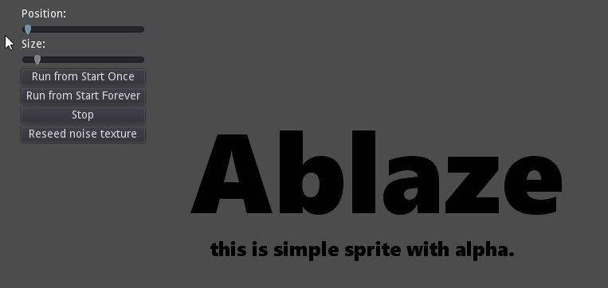
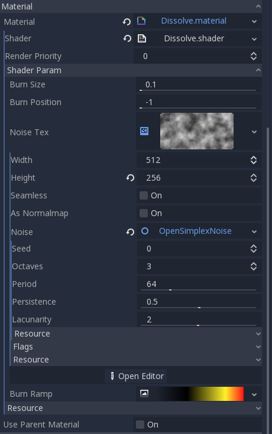

# NO LONGER MAINTAINED.

Please look at [godotshaders.com](https://godotshaders.com)

For example: https://godotshaders.com/shader/fire-dissolve-shader/ and many others 🙂 See you there!


# Godot 3.1 Dissolve shader with OpenSimplexNoise


Simple tutorial-like Dissolve Shader and Material for GODOT 3.1 alpha 2



The Hearth of project is simple [Dissolve Shader](Materials/Dissolve.shader) with 4 uniforms:

```shader
shader_type canvas_item;

//  noise texture (see Dissolve.material for GUI Generated one or Main.gd::_on_reseed_noise_pressed() for scripted one)
uniform sampler2D noise_tex : hint_albedo;
// burn ramp (gradiant from some color to transparent) - see Dissolve.material for GUI generated one
uniform sampler2D burn_ramp : hint_albedo;
// size of burning path (0 is infinitely short)
uniform float burn_size : hint_range(0.1, 1);

// position (time) of burning
uniform float burn_position : hint_range(-1, 1);

void fragment()
{
	// get texture pixel color * tint
	// thats our result without burning effect.
	// We use COLOR as final color (we can use variable and assign it to COLOR at the end, but there is no reason to care)
	// TEXTURE is Sprite.Texture from GODOT
	// UV is UV from GODOT
	// At first, COLOR is filled with tint (Sprite -> Modulate) from GODOT (and from vertex shader).
	COLOR = texture(TEXTURE, UV) * COLOR;
	
	// get some noise minus our position in time (thats why burn_position is range(-1, 1))
	float test = texture(noise_tex, UV).r - burn_position;
	
	// if our noise is bigger then treshold
	if (test < burn_size) {
	
		// get burn color from ramp
		vec4 burn = texture(burn_ramp, vec2(test * (1f / burn_size), 0));

		// override result rgb color with burn rgb color (NOT alpha!)
		COLOR.rgb = burn.rgb;
		
		// and set alpha to lower one from texture or burn.
		// that means we keep transparent sprite (COLOR.a is lower) and transparent 'burned pathes' (burn.a is lower)
		COLOR.a = min(burn.a, COLOR.a);
	}
}
```

Noise texture can be generated with script:

```
var noise = OpenSimplexNoise.new();
noise.seed = randi();
# noise.octaves = 3;
# noise.period = 64;
# noise.persistence = 0.5;
# noise.lacunarity = 2;

var noise_tex = NoiseTexture.new();

noise_tex.width = 512; # width of sprite
noise_tex.height = 256; #height of sprite
noise_tex.noise = noise;

_material.set_shader_param("noise_tex", noise_tex);
```

or in GUI:




# Licence

## MIT License

Copyright (c) 2018 Jan 'spl!te' Kondelík

Permission is hereby granted, free of charge, to any person obtaining a copy
of this software and associated documentation files (the "Software"), to deal
in the Software without restriction, including without limitation the rights
to use, copy, modify, merge, publish, distribute, sublicense, and/or sell
copies of the Software, and to permit persons to whom the Software is
furnished to do so, subject to the following conditions:

The above copyright notice and this permission notice shall be included in all
copies or substantial portions of the Software.

THE SOFTWARE IS PROVIDED "AS IS", WITHOUT WARRANTY OF ANY KIND, EXPRESS OR
IMPLIED, INCLUDING BUT NOT LIMITED TO THE WARRANTIES OF MERCHANTABILITY,
FITNESS FOR A PARTICULAR PURPOSE AND NONINFRINGEMENT. IN NO EVENT SHALL THE
AUTHORS OR COPYRIGHT HOLDERS BE LIABLE FOR ANY CLAIM, DAMAGES OR OTHER
LIABILITY, WHETHER IN AN ACTION OF CONTRACT, TORT OR OTHERWISE, ARISING FROM,
OUT OF OR IN CONNECTION WITH THE SOFTWARE OR THE USE OR OTHER DEALINGS IN THE
SOFTWARE.
